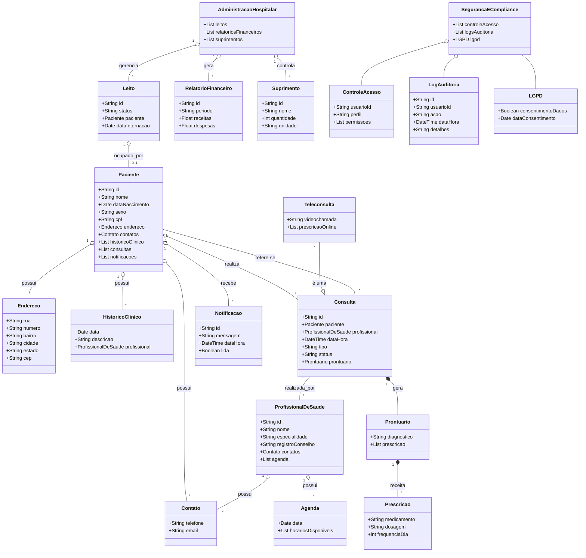

# SGHSS - Sistema de Gestão Hospitalar e Serviços de Saúde

## O que é o projeto?
O SGHSS é uma aplicação desenvolvida em Java com Spring Boot para gerenciar dados hospitalares e serviços de saúde. O sistema permite o cadastro e acompanhamento de pacientes, profissionais de saúde, consultas, prescrições, leitos, suprimentos e relatórios administrativos e financeiros. O objetivo é facilitar a gestão hospitalar, integrando informações clínicas e administrativas em uma única plataforma.

## Tecnologias utilizadas
- **Java 21**
- **Spring Boot 3.5.6**
- **Spring Data JPA** (persistência de dados)
- **Spring Validation** (validação de dados)
- **Spring Web** (APIs REST)
- **Maven** (gerenciamento de dependências)
- **Jakarta Persistence**

## Estrutura do Projeto
- `src/main/java/com/vidaplus/sghss/domain` - Entidades de domínio
- `src/main/java/com/vidaplus/sghss/controller` - Controllers REST
- `src/main/java/com/vidaplus/sghss/repository` - Repositórios JPA
- `src/main/java/com/vidaplus/sghss/service` - Serviços de negócio
- `src/main/resources` - Configurações e templates
- `src/test` - Testes automatizados

## Próximas etapas
1. **Implementar autenticação e autorização** (Spring Security)
2. **Criar testes automatizados para os serviços e controllers**
3. **Documentar as APIs REST (Swagger/OpenAPI)**
4. **Adicionar integração com sistemas externos (ex: faturamento, convênios)**
5. **Melhorar a interface de usuário (se houver front-end)**
6. **Monitorar e registrar logs de operações críticas**
7. **Preparar o deploy em ambiente cloud ou on-premises**

## Como executar
- Build: `./mvnw clean install`
- Testes: `./mvnw test`
- Executar: `./mvnw spring-boot:run`

## Documentação do Domínio

### Diagrama de Classes e Entidade-Relacionamento

